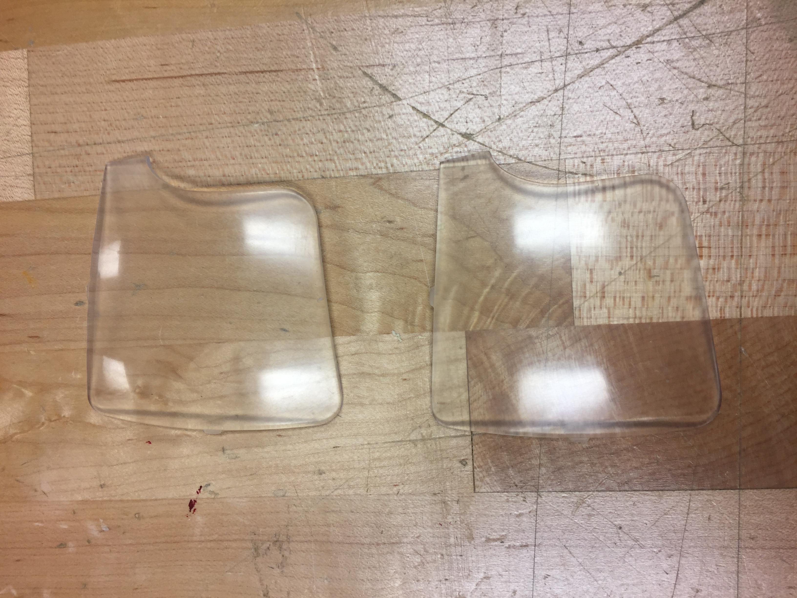
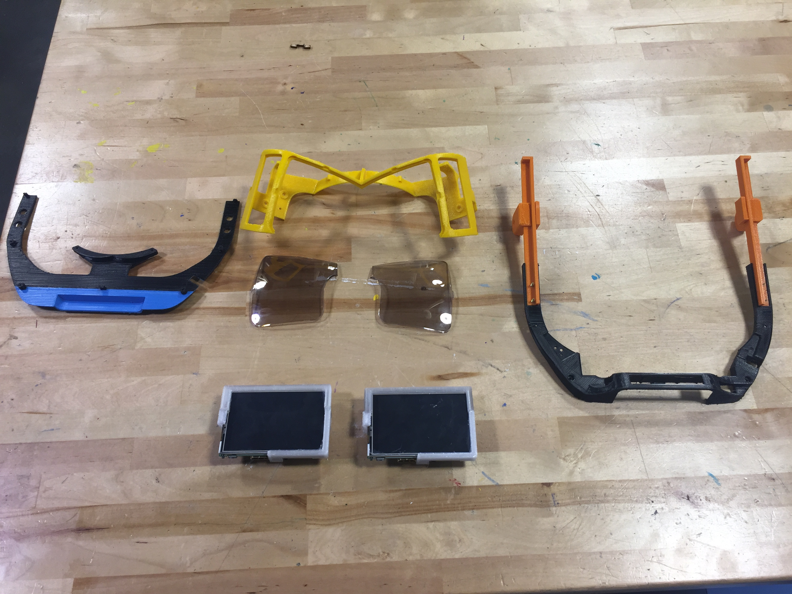
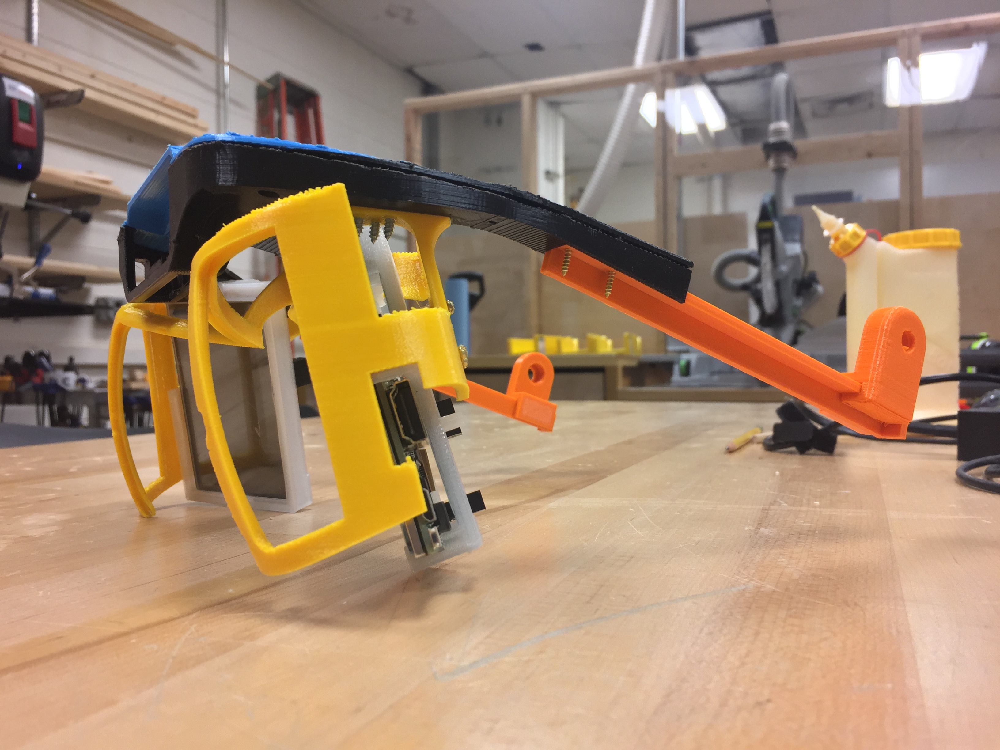
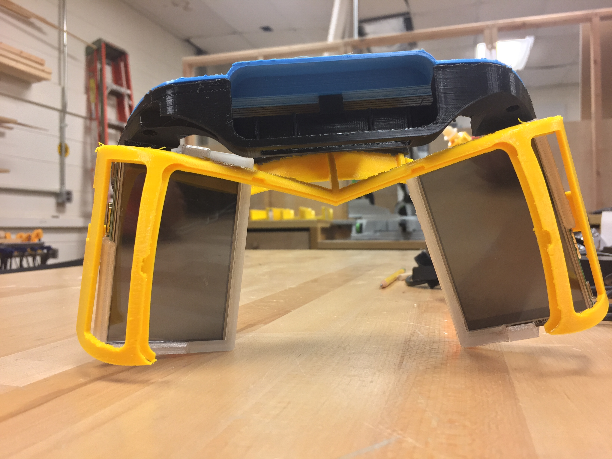
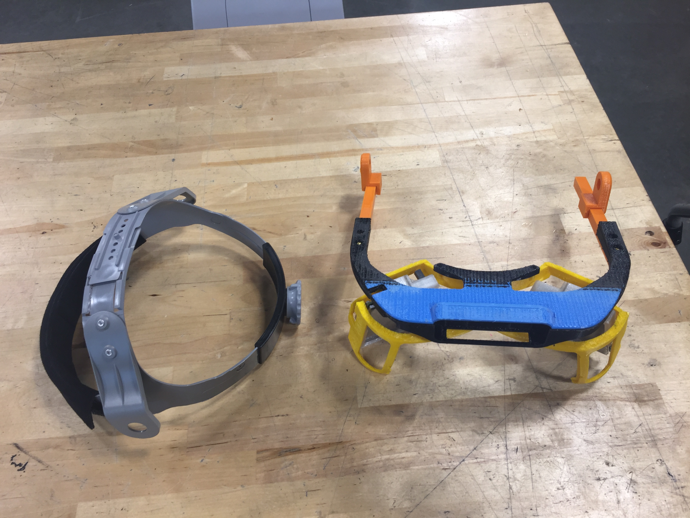
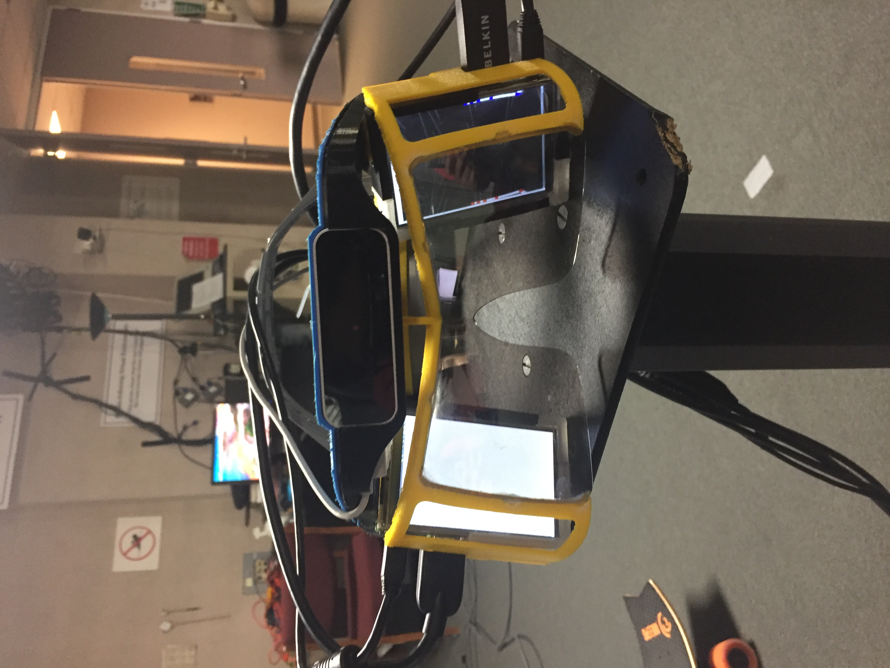
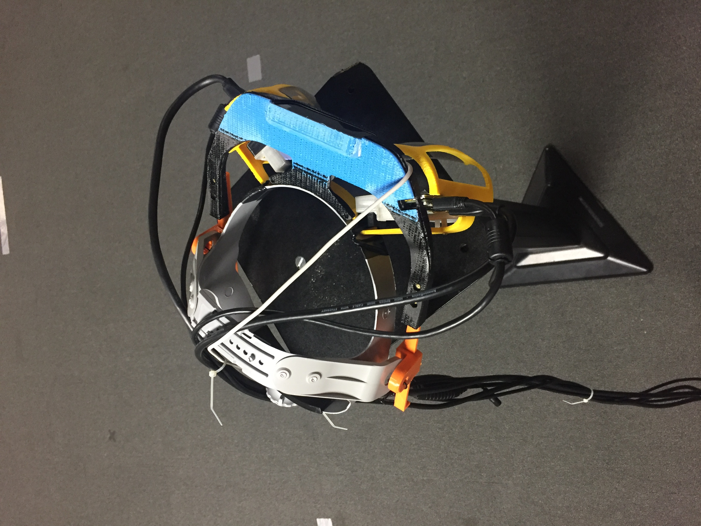

# Project North Star
Project North Star is an open sourse project by Leap Motion, which levrages wide FoV and hand tracking for a more immersive and seamless AR experience.

## Stage 1: Parts
- Frame: 3D printed using CPE filament on Ultimaker 3 printers. 
- Lens: [Smart Prototyping](https://www.smart-prototyping.com/Project-North-Star-Lens)
- Screens: [raspbery pi screens](https://www.amazon.com/OSOYOO-Monitor-Display-instructions-Raspberry/dp/B01N447AEY/ref=sr_1_1?ie=UTF8&qid=1533769748&sr=8-1&keywords=3.5+inch+monitor+hdmi)
- Headgear: [Welding helmet headgear](https://www.amazon.com/Fibre-Metal-Honeywell-1CR-Pipeliner-Headgear/dp/B007NL7VQ0/ref=sr_1_4?keywords=headgear+%2B+welding+helmet&qid=1561055121&s=gateway&sr=8-4)
- Screws: Hillman 4 X 1/2 Metal Screws, Hillman 2 X 1/2 Wood Screws
## Stage 2: Building 
### Lens:
The lens can be bought from [Smart Prototyping](https://www.smart-prototyping.com/Project-North-Star-Lens) or can by 3D printed using clear resin and then polished.

**How to Polish**
1. Start at 400 Grit Sandpaper and move up in 300 level increments until lens is clear. **Spend at least 10 minutes on each level**
1. Use Novus plastic polish solutions to get make the lens smooth 3 -> 2 -> 1. **Spend at atleast 15 mins with each solution and use copious amounts of the solution. 

**Sand under running water**

### 3D Printed Parts:
The parts for the frame of the headset were 3D printed with CPE filament on Ultimaker 3 printers. 

**Important Settigns** 
Infill: 90%
Print Speed: Fast 

### Assembly: 

#### Pre-Building Steps: The Lens Holder is blocking the power supply to the screens, so sentions of it had to be cut off to make room for the power supply. 

#### Step 1: Put the screens together using LCD Holder A and LCD Holder B
#### Step 2: Attach Screens to Lens Holder
#### Step 3: Attach leap motion holder and side railings

 
 

#### Step 4: Attach lens' using lens adhesive (DO NOT USE SUPER GLUE)

#### Step 5: Attach Head Gear to side railings using zip ties or wire

#### Step 6: Attach HDMI, leap motion and power cables

### Finished Product: 

 

## Stage 3: Calibration

#### Step 1: Download and open the calibration unity package from the calibration folder
#### Step 2: Go to /leapmotion/northstar/ and open the scene
#### Step 3: Click on AR-Camera and assign the calibration file location and change the name of the output file
#### Step 4: Click on move game view button and press play 
#### Step 5: DON THE HEADSET
#### Step 6: Move the cursor to the northstar screens and right click to enable hot keys
#### Step 7: Use the hotkeys to get the size of the hand as close to real size as possible, dont worry about calibration yet
#### Step 8: Left click on the center of the screen and drag the skeleton hand to superimpose the hand
#### Step 9: Repeat Step 9 by putting hand in edges of the lens and dragging the hand to superimpose, repeat for both both hands
#### Step 10: press save hotkey to save calibration file

Credits: [tasuku](https://www.youtube.com/watch?v=kLaPxL-DBeo), [eswar](https://medium.com/@A.eswar/project-north-star-calibration-pixel-hacking-trial-and-error-ea3f46ea5d7f)

## Stage 4: TBD

## **The project is under constant imporvement with plans to add more functonality and test cases**

## Credits
Project North Star build with handtrackin and 6Dof. Made using the official [Leap Motion Project North Star](https://github.com/leapmotion/ProjectNorthStar) repo and this [Medium blog](https://medium.com/@pythor/info-to-make-project-north-star-359291368e1f)
